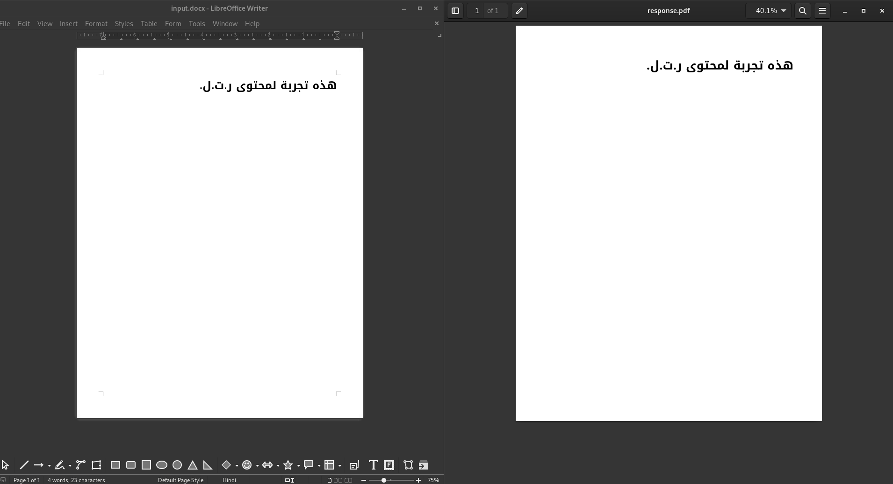
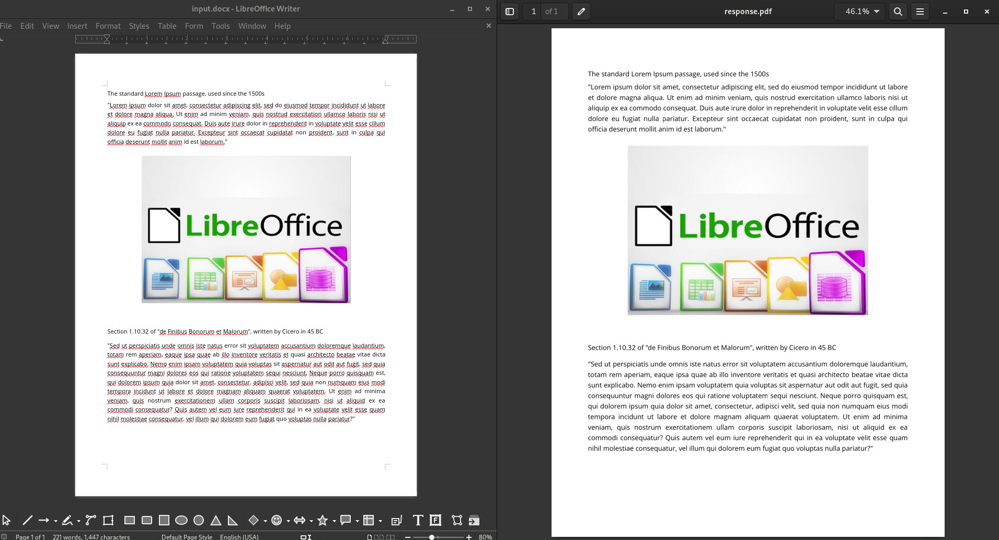

# Docx To PDF

## Overview
This tool transforms Microsoft Word Documents (DOCX) into PDF format.

# The Challenge

Though there's an abundance of tools for DOCX to PDF conversion, many face challenges such as:
- Preserving document formatting.
- Handling Right-to-Left (RTL) text.
- Properly displaying various fonts.

Further complicating matters, many of these tools demand specific environments and have multiple, often redundant, layers of abstraction.

Why is accurate DOCX conversion so challenging? The root of the issue lies in the DOCX specification, known as [**OOXML**](http://officeopenxml.com/index.php).

- **Origin & Complexity**: OOXML, an XML-based format for DOCX documents, was designed by Microsoft. Its specification is incredibly detailed, spanning over 6,000 pages. It even contains inconsistencies, leading to varied interpretations. [It's actually well over 6000 pages long and contradicts itself in some cases.](https://en.wikipedia.org/wiki/Standardization_of_Office_Open_XML#Technical)
- **Implementation Challenges**: The intricate nature of OOXML means that even Microsoft doesn't perfectly implement it in their official applications. The experience of opening a DOCX file can differ between platforms like macOS and Windows.
- **Contrast with PDFs**: PDFs operate on a different structural and conceptual paradigm than DOCX files:
  - They use vector graphics.
  - Text is encoded as streams, not plain text
  - - [Read more about how PDFs work.](https://en.wikipedia.org/wiki/PDF#Imaging_model)

Given these complexities, creating a flawless DOCX to PDF converter remains a daunting challenge, with no full-proof solution in sight.
Not anytime soon.


# LibreOffice to the rescue 
LibreOffice, a powerful open-source office suite, has consistently strived to enhance compatibility with Microsoft Office formats, particularly the .docx format. This is crucial to ensure that users transitioning from Microsoft Office to LibreOffice can continue working with their documents seamlessly.

It offers built-in APIs and a server mode, enabling users to programmatically interface with it through 
[Universal Network Objects (UNO)](https://en.wikipedia.org/wiki/Universal_Network_Objects) API.

While not perfect, it is still the best available solution for free for rendering docx formats.


# Proposd Solution
This service is built in Java, using spring boot, exposing a simple that takes a docx file as an input
and responds back with a `application/pdf` file.

It achieves this by launching a LibreOffice server in the background during initialization, then starts
communicating with the server through the UNO APIs provided by OpenOffice (OO) to:
1. Launch an instance.
2. Load the document.
3. Save the document as PDF.

And then streaming the response back to the user.

# Installation Guide
## Using docker
TODO

## Locally

To run this service locally, you will need the following:
- Java 17
- Maven
  - [Download](https://maven.apache.org/download.cgi) the zip archive.
  - Include the maven binaries within your $PATH environment variable
    ```shell
      $ export PATH=$PATH:/path/to/folder/apache-maven-3.9.4/bin
    ```
  - ```shell
      $ mvn -v
      Apache Maven 3.9.4 (dfbb324ad4a7c8fb0bf182e6d91b0ae20e3d2dd9)
    ```
    
- LibreOffice, make sure it's available in your system through the $PATH variable.
  - ```shell
      $ libreoffice --version
        LibreOffice 7.5.6.2 50(Build:2)
    ```     
    
- Clone this repository and then from the home directory run the service 
  - ```shell
      $ mvn spring-boot:run
    ```
- Expect the service to be running on port 8080 by default.
  ```
    2023-10-06T22:36:06.922+03:00  INFO 1513874 --- [           main] d.a.d.DocxToPdfKotlinApplicationKt       : No active profile set, falling back to 1 default profile: "default"
    2023-10-06T22:36:07.414+03:00  INFO 1513874 --- [           main] o.s.b.w.embedded.tomcat.TomcatWebServer  : Tomcat initialized with port(s): 8080 (http)
    2023-10-06T22:36:07.419+03:00  INFO 1513874 --- [           main] o.apache.catalina.core.StandardService   : Starting service [Tomcat]
    2023-10-06T22:36:07.419+03:00  INFO 1513874 --- [           main] o.apache.catalina.core.StandardEngine    : Starting Servlet engine: [Apache Tomcat/10.1.13]
    2023-10-06T22:36:07.463+03:00  INFO 1513874 --- [           main] o.a.c.c.C.[Tomcat].[localhost].[/]       : Initializing Spring embedded WebApplicationContext
    2023-10-06T22:36:07.464+03:00  INFO 1513874 --- [           main] w.s.c.ServletWebServerApplicationContext : Root WebApplicationContext: initialization completed in 513 ms
    2023-10-06T22:36:07.554+03:00  INFO 1513874 --- [atcher-worker-1] d.a.docxtopdf.server.LibreOfficeServer   : [LibreOffice/0] Starting server instance..
    2023-10-06T22:36:07.788+03:00  INFO 1513874 --- [           main] o.s.b.a.e.web.EndpointLinksResolver      : Exposing 1 endpoint(s) beneath base path '/actuator'
    2023-10-06T22:36:07.813+03:00  INFO 1513874 --- [           main] o.s.b.w.embedded.tomcat.TomcatWebServer  : Tomcat started on port(s): 8080 (http) with context path ''
    2023-10-06T22:36:07.821+03:00  INFO 1513874 --- [           main] d.a.d.DocxToPdfKotlinApplicationKt       : Started DocxToPdfKotlinApplicationKt in 1.071 seconds (process running for 1.22)
    ```

# Usage
Once the service is up and running, you can try hitting the service at the `/pdf` endpoint.

### Sample cURL:
```shell
curl \ 
--location 'http://localhost:8080/pdf' \
--form 'document=@"/home/moalhaddar/example.docx"'
```

### Sample Fetch
```javascript
var formdata = new FormData();
formdata.append("document", fileInput.files[0], "file.docx");

var requestOptions = {
  method: 'POST',
  body: formdata,
};

fetch("http://localhost:8080/pdf", requestOptions)
  .then(response => response.text())
  .then(result => console.log(result))
  .catch(error => console.log('error', error));
```

# Examples
 The below example files are included within this repository [here](./examples)

### Example 1: Regular LTR Text with font


### Example 2: Regular RTL Text with font


### Example 3: An Image wtih text


### Example 4: A table


# Performance
This tool was designed with performance in mind. 

The default settings runs the service with one converter worker only. If you have enough system resources available and
need to increase the worker pool size, you can do so by providing the environment variable `pool.size` to the service.

Or you can do so by uncommenting the `pool.size` line in the [properties](./src/main/resources/application.properties) file.

I've stress tested this service with concurrent requests with a very simple 1-page docx file, here are the details:

| Number Of Concurrent Requests | Number Of Workers | Time to serve all requests |
|-------------------------------|-------------------|----------------------------|
| 50                            | 1                 | 5.594s                     |
| 50                            | 4                 | 1.880s                     |
| 50                            | 8                 | 1.277s                     |
| 50                            | 16                | 1.081s                     |

Keep in mind that the input file complexity matters a lot when it comes to the conversion performance.

If you have any performance observations, don't hesitate to open and report an issue.

# License
MIT License

# Author
Mohammad Alhaddar